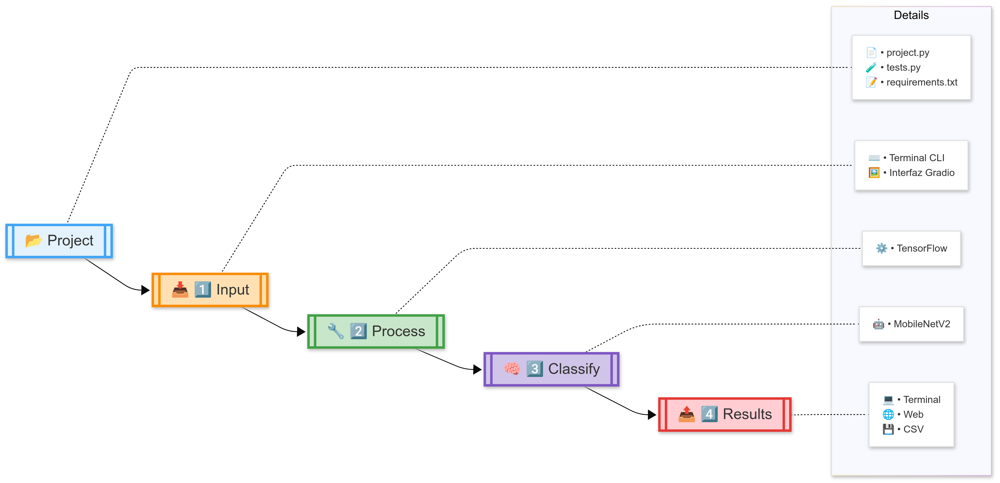

<div align="center">

# 🖼️ Image Classifier with AI 🤖 
### *CS50 Final Proyect*   
</div>

#### 🌐 Connect with Me:  
- **YouTube Channel**: [Javier Ramírez Moral on YouTube](https://www.youtube.com/@TerraKubeSphere)  
- **LinkedIn**: [Javier Ramírez Moral on LinkedIn](https://www.linkedin.com/in/javier-ram%C3%ADrez-moral-267191215/)  

# 🎥 Video Demo: [Watch the Demo](https://youtu.be/JeNU9jJKfVg?si=QdhCGj_qcLmah1mJ)  
.png)
---  

---

## 📖 Description  

This project implements an intelligent image classification system using TensorFlow and the MobileNetV2 model, optimized for performance and efficiency in resource-constrained environments. Designed as the final project for CS50P, it goes beyond the basic requirements by incorporating a robust architecture, automated testing, and a user-friendly experience via both command-line and web interfaces.  

The goal is to allow users to upload one or multiple images, process them, and receive high-accuracy predictions about their content, all with a friendly interface and options for result traceability.  

---

## 📂 Project Structure  

### 📜 Main Program: `project.py`  
| **Function**               | **Description**                                                                 |
|----------------------------|---------------------------------------------------------------------------------|
| `main()`                   | Entry point: CLI or GUI                                                        |
| `load_and_preprocess(path)`| Resizes images to 224x224px, normalizes pixel values to [0, 1]                  |
| `classify(img_array)`      | Uses pre-trained MobileNetV2 for predictions                                   |
| `display_results(predictions)` | Displays top 3 predictions with percentages                                 |
| **Bonus Functions**        |                                                                                 |
| `save_to_csv()`            | Saves results with timestamp                                                   |
| `gradio_interface()`       | Provides a real-time web interface                                             |
| `batch_process()`          | Handles batch image classification                                             |

---

### 📂 Folder Structure  

| **Folder/File**            | **Description**                                                                 |
|----------------------------|---------------------------------------------------------------------------------|
| `project.py`               | Main application logic                                                         |
| `test_proyect.py`          | Unit tests for core functionality                                              |
| `requirements.txt`         | List of dependencies                                                           |
| `README.md`                | Documentation for the project                                                  |
| `assets/`                  | Contains sample images for testing                                             |
| `results.csv`              | Stores classification results in CSV format                                    |
| `.gradio/`                 | Temporary files generated by Gradio                                            |
| `__pycache__/`             | Compiled Python files for performance optimization                             |

---
### 🧠 Model Architecture  

MobileNetV2 is used through transfer learning, leveraging pretrained weights on the ImageNet dataset. This allows the system to generate accurate predictions without training the model from scratch. Images are preprocessed to meet the model's input requirements:  

- **Resizing**: Images are resized to 224x224 pixels.  
- **Normalization**: Pixel values are scaled to the [0, 1] range.  
- **Prediction**: The model outputs a list of class probabilities, sorted from highest to lowest.  

---

### 📝 Dependencies  

| **Dependency**             | **Version**                                                                    | **Purpose**                                                                 |
|----------------------------|---------------------------------------------------------------------------------|-----------------------------------------------------------------------------|
| `tensorflow`               | >=2.10.0                                                                       | Core library for deep learning and MobileNetV2                             |
| `numpy`                    | >=1.21.0                                                                       | Numerical operations and array manipulation                                |
| `pytest`                   | >=7.0.0                                                                        | Unit testing framework                                                     |
| `gradio`                   | >=3.0.0                                                                        | Web-based GUI for user interaction                                         |
| `pandas`                   | >=1.3.0                                                                        | CSV handling and data manipulation                                         |

Install dependencies with:
```bash
pip install -r requirements.txt
```

---

### 🧪 Unit Tests  

| **Test Function**          | **Description**                                                                 |
|----------------------------|---------------------------------------------------------------------------------|
| `test_load_and_preprocess_image()`| Tests the image preprocessing functionality                                    |
| `test_classify_image()`    | Verifies the classification process                                            |
| `test_display_predictions()`| Ensures results are displayed correctly                                        |

Run tests with:
```bash
pytest test_proyect.py
```

---

### 🌟 Core Features  

- **CLI Mode**:  
  Run the program in the terminal:
  ```bash
  python project.py
  ```
  Example input:
  ```
  CLI or GUI mode? (cli/gui): cli
  Image path (e.g. 'assets/dog.jpg'): assets/animals/dog.jpg
  ```
  Example output:
  ```
  🔍 Results:
  1. Golden Retriever (85.67%)
  2. Labrador Retriever (10.23%)
  3. Cocker Spaniel (4.10%)
  ```

- **GUI Mode**:  
  Launch the Gradio interface:
  ```bash
  python project.py
  ```
  Open the browser at `http://127.0.0.1:7860` to upload images and view predictions.

- **Batch Processing**:  
  Process multiple images at once:
  ```python
  from project import batch_process
  results = batch_process(["assets/animals/cat.jpg", "assets/food/pizza.jpg"])
  print(results)
  ```

---

## 🤔 Design Choices  

1. **Model Selection**: Chose MobileNetV2 for its balance of accuracy and efficiency  
2. **Dual Interface**: Implemented both CLI and GUI to accommodate different user preferences (`python project.py --cli` | `python project.py --web`)  
3. **CSV Logging**: Added persistent storage for result tracking  
4. **Test Coverage**: Focused tests on core functions while keeping bonus features as extensions  

---

## ⚙️ How It Works  

The data flow follows these steps:  

1. **Input**: The user provides an image via the CLI or GUI.  
2. **Preprocessing**: The image is resized and normalized.  
3. **Inference**: MobileNetV2 generates predictions.  
4. **Postprocessing**: The top three predictions are selected and formatted for display.  
5. **Output**: Results are shown on screen and saved to a CSV file for later analysis.  
---

### ⚡ Optimization and Performance  

- **GPU Utilization**: If available, TensorFlow leverages the GPU to speed up predictions.  
- **Batch Processing**: A function is implemented to process multiple images in parallel, optimizing execution time.  
- **Model Size**: MobileNetV2 is lightweight, making it ideal for resource-constrained environments.  

---

### 📂 CSV Output  

The `results.csv` file stores classification results in the following format:
| **Date**           | **Image Name** | **Top Prediction**       | **Second Prediction** | **Third Prediction** |
|--------------------|----------------|--------------------------|-----------------------|-----------------------|
| 2023-10-01 12:00  | cat.jpg        | Tabby (85.67%)           | Tiger Cat (10.23%)    | Egyptian Cat (4.10%) |

---

### 🛠️ Error Handling  

- **Missing Image**:  
  If the image path is invalid, the program will print an error message and return `None`.

- **Missing Dependencies**:  
  Ensure all dependencies are installed using `pip install -r requirements.txt`.

---

## 🚀 Setup Instructions  

1. Clone the repository:
   ```bash
   git clone <repository_url>
   cd CS50P_Final_Project
   ```

2. Install dependencies:
   ```bash
   pip install -r requirements.txt
   ```

3. Run tests to verify functionality:
   ```bash
   pytest test_proyect.py
   ```

4. Start the application:
   ```bash
   python project.py
   ```

---

### 🌟 Use Cases  

This system has several practical applications, including:  

- **Real-time image classification** in surveillance systems.  
- **Large-scale data analysis** in research projects.  
- **Integration into mobile apps** for object recognition.  

---

### 🚧 Known Limitations  

- **Maximum Image Size**: Very large images may consume excessive memory and slow down the system.  
- **Limited Categories**: The model is pretrained on ImageNet, which may limit accuracy for classes outside this dataset.  
- **Hardware Dependency**: Performance may be slower on systems without a GPU.  

---

### 🔮 Future Improvements  

- **Cloud Integration**: Deploy the system on platforms like AWS or Google Cloud to process images at scale.  
- **Mobile Compatibility**: Optimize the model for mobile devices using TensorFlow Lite.  
- **Expanded Categories**: Train the model on custom datasets to support more classes.  
- **GUI Enhancements**: Add drag-and-drop image upload functionality to the graphical interface.  

---

## 🌐 WEB PAGES

- **CS50**: [CS50](https://cs50.harvard.edu/python/2022/)  
- **tensorflow**: [TensorFlow](https://www.tensorflow.org/tutorials/images/classification?hl=es-419)  
- **MobileNetV2**: [MobileNetV2](https://keras.io/api/applications/mobilenet/)  

---

<div align="center">
Made with ❤️ by Javier Ramírez Moral
</div>